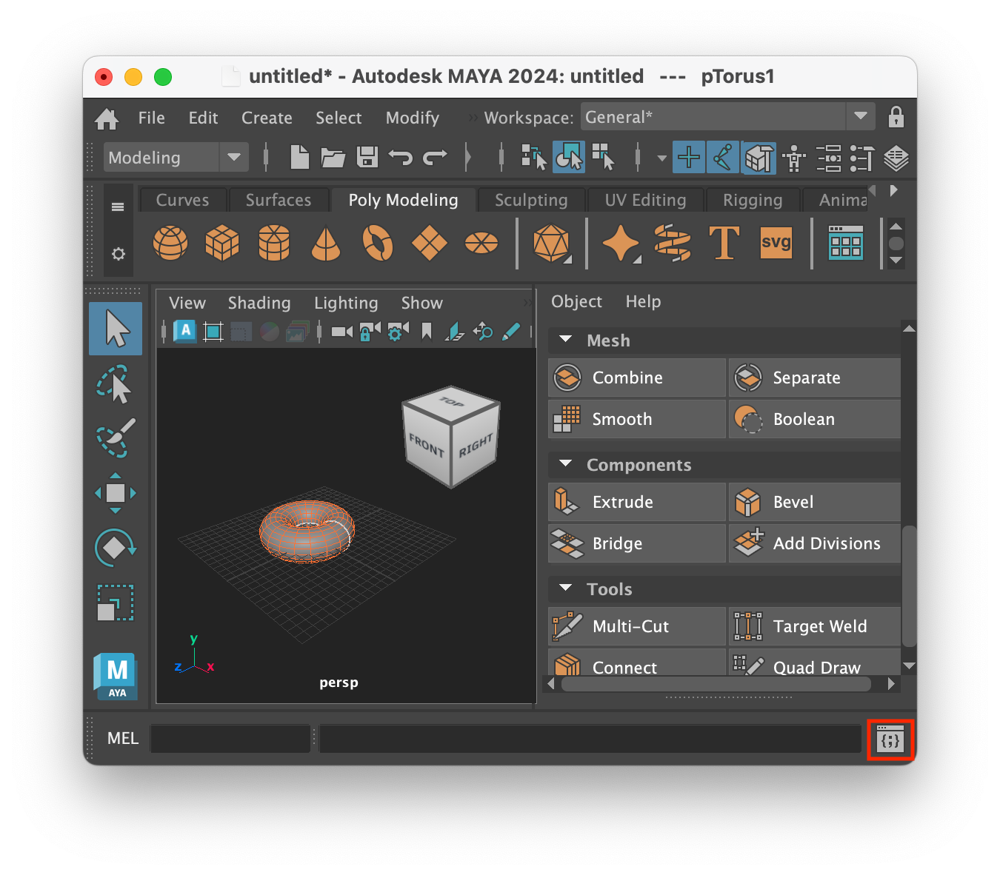
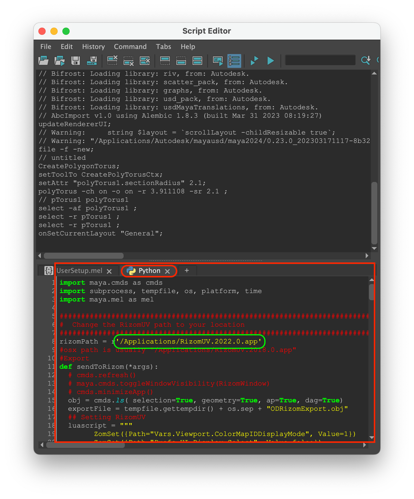
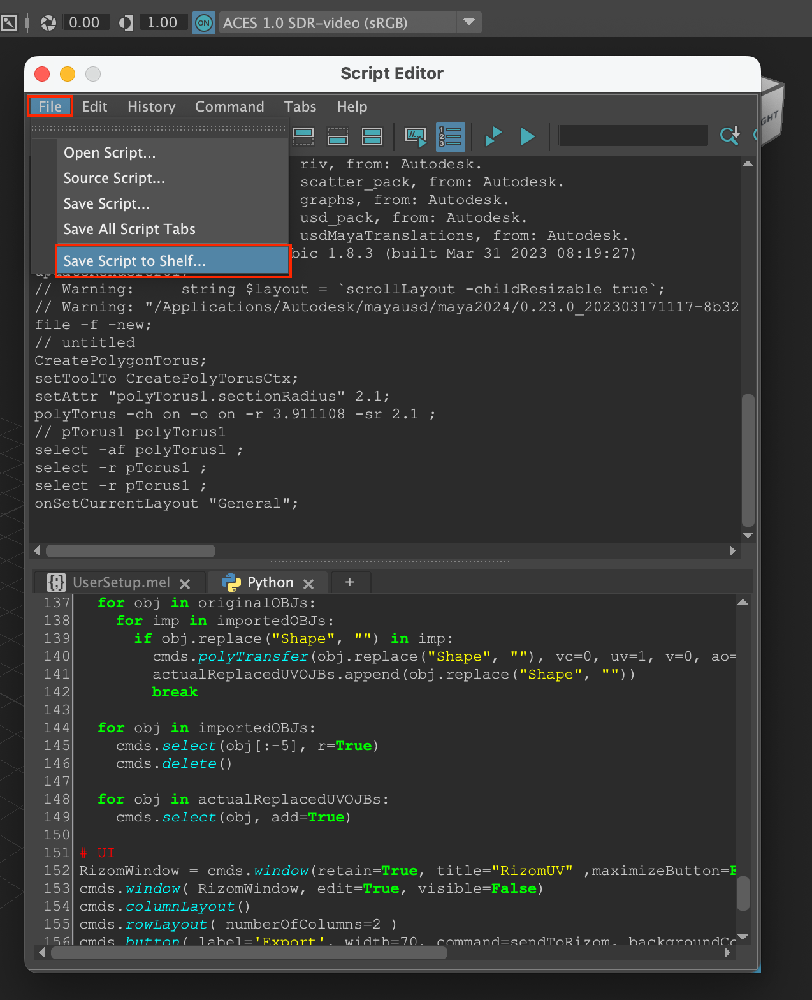
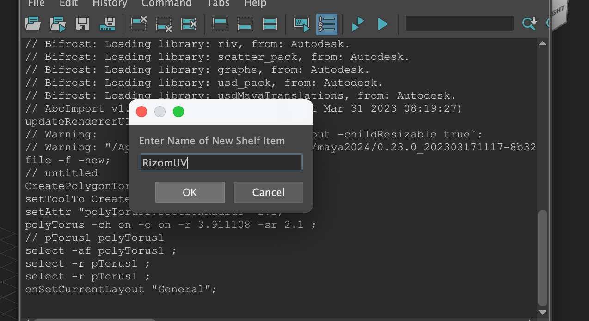
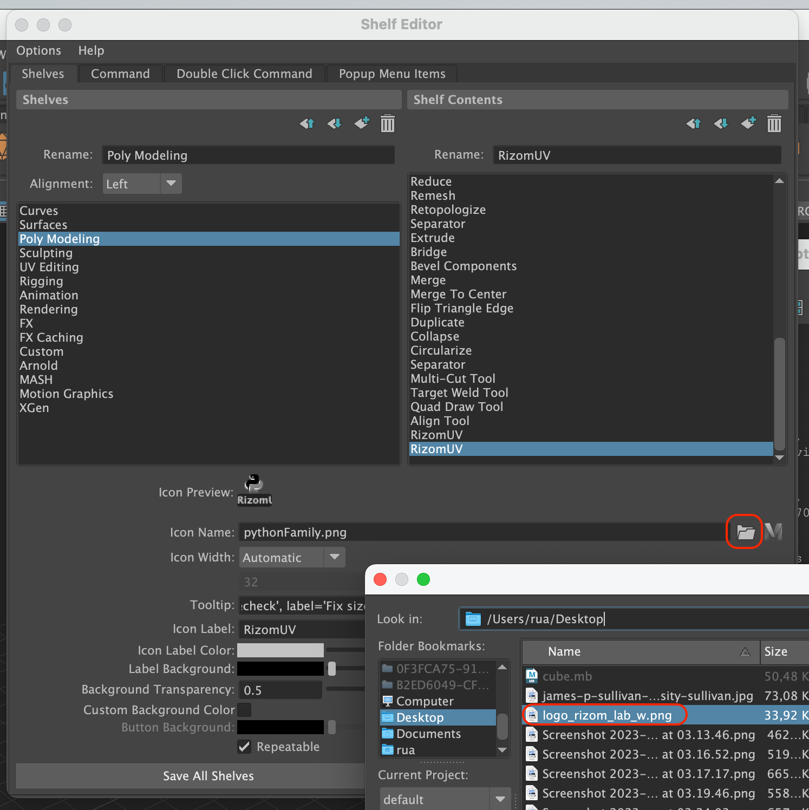
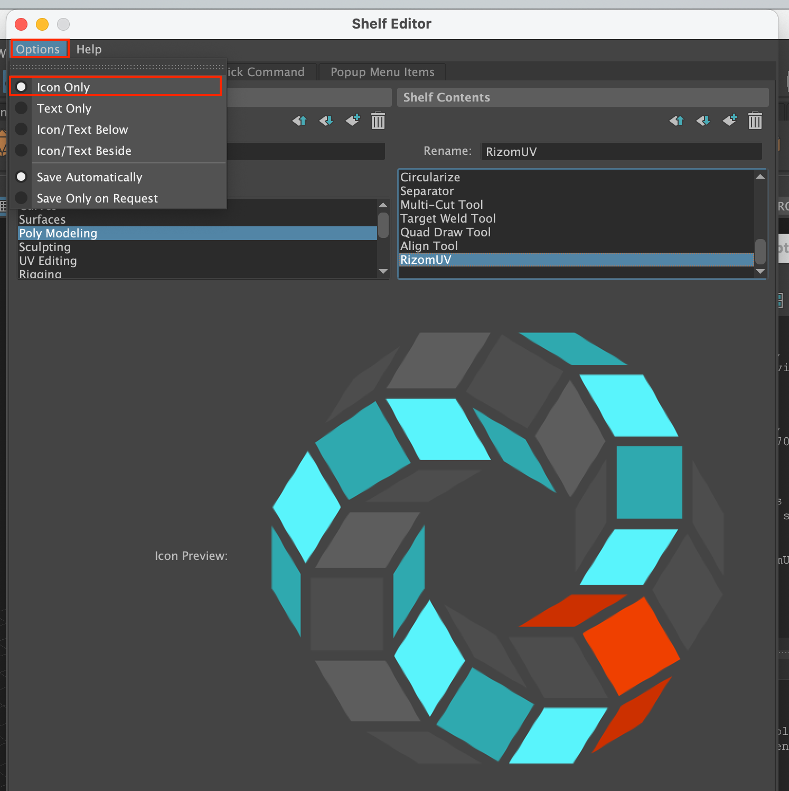
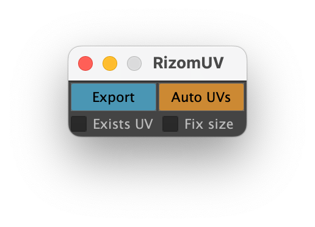
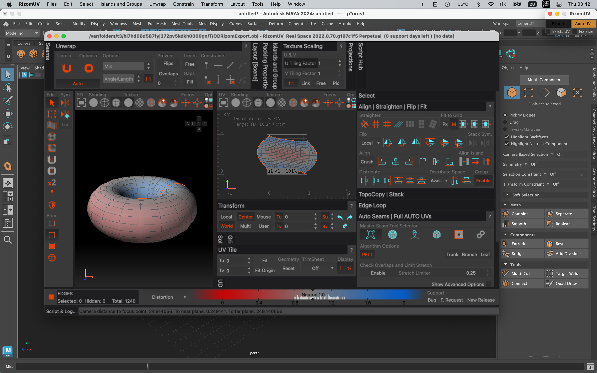

# Brigde Maya to RizomUV
This source code used the source code from [RizomUV's](https://www.rizom-lab.com/bridges/) link to [Origami Digital Software](https://origamidigital.com/cart/index.php?route=product/product&path=59_61&product_id=53) and edited it for more convenient use in my work. I posted it here to share it with everyone. thanks

## Fixbug
* Fixed Rizomuv's default settings.
* Fix Packing error
* Change color display mode. Rizom
* Fixed Maya UV map linking after UV slicing was completed.
* Incorporate the get UV feature after saving the UV map
* Workflow is seamless without interruption.
* Remove unnecessary menu sections
* Re-adjust the compact interface.
---
## Installation
---
0. Download [logo](https://github.com/nguyendinhat/Brigde_Maya_RizomUV_MacOS/blob/main/logo_rizom_lab_w.png)  
1. Copy [scripts](https://github.com/nguyendinhat/Brigde_Maya_RizomUV_MacOS/blob/main/scripts.py) 
  
2. Open Script Editor on Maya 
  
4. On windows Script Editor select tab Python in window belows 
5. Paste scripts copied in here 
6. Check path folder RizomUV's in your computer 
  
7. Select File > Save Script to Shelf
  
8. Set name
    
9. Add logo
  
10. Option > Only Icon
    Save!
  
11. Open and try it
  

Have fun!

## License 
GNU GENERAL PUBLIC LICENSE.md
---

 

## About the author
@nguyendinhat 
